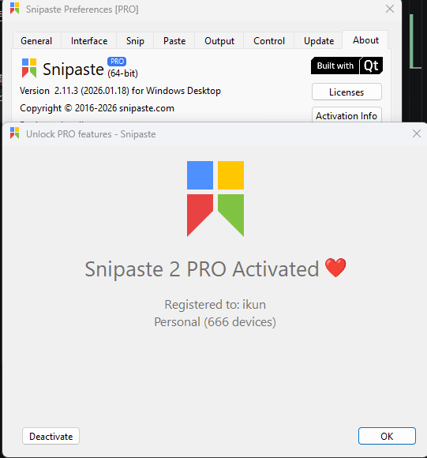

# Snipaste v2.11.3 离线授权分析

## 声明
本项目基于：[Snipaste-2.10.8-x64 离线激活记录 - DirWangK - 博客园](https://www.cnblogs.com/DirWang/p/19258416) 文章中的代码进行更新来兼容snipaste v2.11.3 版本。
项目地址： https://github.com/1226357697/snipaste_keygen/tree/main

效果图：


## 离线授权方案

### 0. 总览

授权码（用户输入的序列号）形如：

```
0X-<Base64载荷>
│└┬┘ └────────── 载荷
│ └─ 校验字符
└─── 类型/版本标记（'0'）
```

载荷解码后是一段 **gzip 压缩 + XOR 混淆的 JSON**，JSON 经 **Ed25519 签名**保护，内含设备绑定信息。客户端离线校验时：验证格式 → 校验位 → 解码 → 验签 → 解析字段 → 逐项比对设备环境。

完整数据流：

```
明文 JSON(license info)
  │  Ed25519 私钥签名 → sig(64B)
  │  body = gzip(JSON) ^ sig          (单次 XOR, 在 gzip 之后)
  │  data = sig(64B) + body
  │  Base64 编码
  │  前缀: '0' + 校验字符 + '-'
  ▼
授权码字符串
```

客户端逆向还原后做 Ed25519 验签，再把 JSON 字段与本机环境比对。

---

### 1. 授权码外层格式

#### 1.1 结构

| 位置 | 内容 | 说明 |
|------|------|------|
| `[0]` | `'0'` | 类型/版本标记（固定 `0`） |
| `[1]` | 校验字符 | 对 Base64 载荷算出的校验字符 |
| `[2]` | `'-'` | 分隔符（ASCII 45），客户端强制要求 |
| `[3:]` | Base64 载荷 | 真正的数据 |

客户端入口 `setLicenseKey`（`sub_14024C9C0`）：
- 要求 `len > 3` 且 `code[2] == '-'`，否则直接判废。
- 取 `code[1]` 作为校验字符，与对载荷算出的校验字符比对。

#### 1.2 校验字符算法（`sub_140288C00`）

对 Base64 载荷字符串求"相邻字符 ASCII 差的绝对值之和"，再取 `载荷[sum % len]` 作为校验字符：

```python
def calculate_adjacent_char_diff_sum(s: str) -> str:
    if not s: return '0'
    if len(s) == 1: return s[0]
    total = sum(abs(ord(s[i]) - ord(s[i-1])) for i in range(1, len(s)))
    return s[total % len(s)]
```

> 仅防手误/防随手伪造，无密码学强度。

#### 1.3 Base64 变体（`sub_140289400`）

客户端自动探测：载荷含 `'+'` 或 `'/'` → 标准 Base64；否则 → URL-safe Base64。
生成端用 `base64.standard_b64encode`（标准表）。

---

### 2. 载荷的解码/解密链

#### 2.1 客户端解码（`postProcessBody` = `sub_14024AB20`）

```
data = Base64解码结果
if len(data) < 65: 原样返回（无效）
header = data[0:64]      # = Ed25519 签名 sig，同时被当作 XOR 密钥
body   = data[64:]

(若非调试) body ^= header        # XOR #1  —— gzip 之前
body = gunzip(body)               # zlib inflate, wbits=31 (gzip 格式)
(若非调试) body ^= header        # XOR #2  —— gzip 之后

return header + body              # body 段即明文 JSON
```

#### 2.2 关键：三次 XOR 与抵消

客户端从原始字节到"验签 message"，对 body 共做 **3 次 XOR**（密钥都是 `sig`）：

| 位置 | 函数 | 操作 |
|------|------|------|
| postProcess gzip 前 | `sub_14024AB20` | `body ^= sig` |
| postProcess gzip 后 | `sub_14024AB20` | `body ^= sig` |
| 验签前 | `sub_14024B1D0` | `body ^= sig` |

后两次相互抵消，验签 message = `gunzip(原始body ^ sig)`。

**因此生成端只需一次 XOR（在 gzip 之后）：**

```python
body = gzip_compress(json_bytes)   # wbits=31
body = s_xor(sig, body)            # 仅一次
data = sig + body
```

#### 2.3 XOR（`sub_14024A190`）

循环密钥 XOR（密钥 = 64 字节 sig）：

```python
def s_xor(key: bytes, data: bytes) -> bytes:
    return bytes(b ^ key[i % len(key)] for i, b in enumerate(data))
```

#### 2.4 gzip（`sub_140289270`）

zlib `inflateInit2(wbits=31)` = **gzip 格式**（zlib 1.2.11，Qt 自带）。

```python
def gzip_compress(data: bytes) -> bytes:
    co = zlib.compressobj(9, zlib.DEFLATED, 31)
    return co.compress(data) + co.flush()
```

---

### 3. 数字签名

#### 3.1 算法

**Ed25519**（CryptoPP `ed25519Verifier` / `ed25519PublicKey`）。
- 签名 64 字节，公钥 32 字节，私钥 32 字节。
- license 里前 64 字节 = 签名，同时复用为 XOR 密钥。

#### 3.2 签名对象

签名的 message = **明文 JSON 字节**（即 `make_json` 输出的 UTF-8）。
客户端验签 message = `gunzip(body ^ sig)`，必须等于签名时的明文 JSON。

#### 3.3 公钥（客户端硬编码）

客户端硬编码的官方公钥（经 AES-128-CTR 解密后）：

```
86a6313855512c692b7f44a7041a86d02890544923714acaeeb29e52883c9060
```

- 存储位置：`sub_140249FA0` 函数体内，以 8 个 `mov` 立即数形式嵌入（58 字节密文）。
- 加密方式：**AES-128-CTR**（块函数 `sub_14002ECA0`，密钥扩展 `sub_14002EA60`），key/nonce 在 `sub_14024FE70` 懒解密。
- 该公钥对应的私钥在官方手里，无法伪造签名（Ed25519 设计目的）。

#### 3.4 破解方式（二选一）

**方式 A：替换公钥**
用自己的密钥对，把硬编码公钥密文替换成自己公钥的密文（同一 AES-CTR keystream，因已知明文+密文可异或得 keystream）。

**方式 B：patch 验签逻辑（已采用，更干净）**
真正执行 Ed25519 验签的是 `sub_140250020`（在 `sub_14024B630` 内，地址 `0x14024B87B`）。其返回值经 `movzx ebx, al`（`0x14024B880`）保存。

Patch：
```
地址 0x14024B880
原: 0F B6 D8        movzx ebx, al
改: B3 01 90        mov bl, 1 ; nop
```
定位字节序列：`0F B6 D8 48 89 6C 24 48 48 8D 05` → 把开头 `0F B6 D8` 改为 `B3 01 90`。
效果：验签结果恒为 true，接受任意签名。

> 本项目使用方式 B，故 `main.py` 中的密钥对可为自签密钥。

#### 3.5 自签密钥对（main.py）

```
PRIVATE_KEY = 951743f1381818ec1af9a32a2eafce42c6261f5089468ef863e7b903c183b3f6
PUBLIC_KEY  = 1ebf8f1197d33a99aee6c625e306739eb9bf1c2806324eb7b83a09933062aa04
```

---

### 4. 授权信息 JSON

#### 4.1 结构（`make_json`）

```json
{
  "nam": "XXXX",
  "eml": "XXXX",
  "lic": "XXXX",
  "dev": XXXX,
  "pln": "XXXX",
  "dom": "XXXX",
  "api": 0,
  "iat": "TIME",
  "exp": "TIME",
  "exx": "TIME",
  "ref": "TIME",
  "hwi": {
    "machineid": "XXXX-XXXXXXXX-XXXXXXXX",
    "platform": 1,
    "domain": ""
  }
}
```

#### 4.2 客户端解析（`LicenseInfo::fromJson` = `sub_1402442E0`）

- 顶层键名经 `sub_14002B9B0` 等解码器从混淆常量运行时还原（语义已对齐上表）。
- 时间字段用 `QDateTime::fromString(s, Qt::ISODateWithMs)` 解析。
- 解析结果存入 LicenseInfo 结构体（偏移见下）。

#### 4.3 结构体字段偏移（Qt6，QByteArray=24 字节）

| 字段 | JSON 键 | 结构体偏移 |
|------|---------|------------|
| nam | nam | +0 |
| eml | eml | +24 |
| lic | lic | +48 |
| dev | dev | +72 (int) |
| pln | pln | +80 |
| dom | dom | +104 |
| iat | iat | +128 (QDateTime) |
| exp | exp | +136 |
| exx | exx | +144 |
| ref | ref | +152 |
| platform | hwi.platform | +160 (int) |
| machineid | hwi.machineid | +168 |
| domain | hwi.domain | +216 |
| api | api | +240 (byte) |

---

### 5. 离线校验逻辑（`validate` = `sub_140245880`）

返回状态码，映射到提示文案（`sub_140245EA0`）。状态码：`0`=成功，`12`=无效凭证，`8`=时钟过早，`31`=已过期。

```c
// 门槛1: eml 非空 且 platform == 1
if (eml.isEmpty() || platform != 1) return 12;

// 门槛2: dom 非空时, decode(dom)==工作组 或 dom==hex(blake2s(工作组)).upper()
if (!dom.isEmpty()) {
    wg = getWorkgroup();                         // NetWkstaGetInfo
    if (compare(decode(dom), wg)) goto ok;       // way1: 明文工作组
    if (compare(dom, hex(blake(wg)).upper())) goto ok;  // way2: 工作组哈希
    return 12;
}
ok:
// 门槛3: decode(machineid) == 现算设备码 genId(L)
//        L = compute_len(decode(machineid))
if (!compare(genId(L), decode(machineid))) return 12;

// 门槛4: 时间
if (now < iat.addSecs(-1200)) return 8;          // iat 提前 20 分钟容差
if (exp < now)                return 31;
return 0;                                          // 成功
```

#### 5.1 各字段约束总结

| 字段 | 约束 |
|------|------|
| eml | 非空 |
| platform | **必须 == 1** |
| dom | == 本机工作组明文（way1），或 == 工作组 blake2s 的 hex（way2） |
| machineid | decode 后 == 客户端现算设备码（见第 6 节） |
| iat | ≤ now + 20min |
| exp | ≥ now |

> 注：`lic`、`dev`、`pln`、`api` 在 validate 中**不被检查**，可任意填。

---

### 6. 设备码 / machineid

#### 6.1 三种形态（核心易混点）

| 形态 | 示例 | 用途 |
|------|------|------|
| 界面展示码 | `X-XXXXX-XXXXX-XXXXX-XXXXX` | 给用户看（字母映射后） |
| 比较用明文 | `XXXX-XXXXXXXX-XXXXXXXX` | validate 实际比较的值 |
| 字段存储态 | encode 后的字节 | JSON 内部存储（客户端自行编解码） |

**结论：`make_json` 的 `hwi.machineid` 直接填比较用明文 `XXXX-XXXXXXXX-XXXXXXXX` 即可（JSON 层是明文，客户端内部自行 encode/decode）。**

#### 6.2 比较用明文的生成（`genId` = `sub_140288D10`）

```
genId(len) = blake2s('Snipaste 2', '1', MachineUniqueId)[-len:]
           → hex 大写
           → 4-8 分段插 '-'          (sub_140288B00, 首段4 后续8)
           → 追加校验字符             (sub_140288C00)
           → 追加 '1'
```

- `len` 由 `compute_len(decode(machineid字段))` 决定（`sub_140242000`：`(strlen - dash数 - 2) / 2`）。
- 本机方案：`len = 9`，得 `XXXX-XXXXXXXX-XXXXXXXX`。

`MachineUniqueId`（`QSysInfo::machineUniqueId` / `sub_1402754A0`）来源优先级：
1. `HKLM\SOFTWARE\Microsoft\Cryptography\MachineGuid`
2. `HKLM\SOFTWARE\Microsoft\SQMClient\MachineId`

#### 6.3 Blake2s 哈希（`sub_140288F90`）

```python
def x_Blake2s_128(data: bytes, r_sz: int) -> bytes:
    h = hashlib.blake2s(digest_size=16)   # Blake2s_128 (Qt alg id = 19)
    h.update(b'Snipaste 2')               # 盐1
    h.update(b'1')                        # 盐2
    h.update(data)
    return h.digest()[-r_sz:]             # 取右 r_sz 字节
```

#### 6.4 界面展示码的生成（`x_gen_device_id`，仅展示用）

```
01 | blake2s(MachineGuid)[-4:] | blake2s(工作组)[-4:]
→ hex 大写 + 校验字符
→ 字符映射 "3679EFHKMNPRTWXY"           (sub_140277190)
→ 1-5-5-5-5 分段
```
本机 = `X-XXXXX-XXXXX-XXXXX-XXXXX`。

#### 6.5 字段 encode/decode（`sub_14026DB40` / `sub_14026DC80`）

客户端内部对 machineid 字段做的对称编码（JSON 层不需要，仅供理解）：

```
encode: key = rand % 251
        rotate_right(body, rot)
        body[i] ^= key ^ i
        prepend(key)
decode: key = data[0]
        body[i] ^= key ^ i
        rotate_left(body, rot)
其中 rot = abs(len ^ key) % len
```
`rotate` 由三次 reverse 实现（`sub_14026DE00`，标准 `std::rotate`）。

---

### 7. 工作组（dom 字段）

客户端用 **`NetWkstaGetInfo(level=100)`** 取 `wki100_langroup`（`sub_1402AC550`），**不是** WMI。

```python
def get_workgroup():
    # netapi32.dll NetWkstaGetInfo, level 100, 读 langroup 字段
    ...  # 本机返回 'XXXX'
```

> 早期用 `wmi.Win32_ComputerSystem.Workgroup` 在本机返回 None，导致 dom 错误 —— 必须用 NetWkstaGetInfo 对齐。

dom 字段填本机工作组明文 `"XXXX"` 即可（走 way1）。

---

### 8. 保护机制汇总

| 保护手段 | 实现 | 位置 | 强度 |
|----------|------|------|------|
| 格式校验 | `??-载荷` + 相邻差校验字符 | setLicenseKey | 防手误 |
| Base64 | 自动探测标准/URL-safe | sub_140289400 | 编码 |
| 循环 XOR | 64字节 sig 当密钥 | sub_14024A190 | 混淆（密钥同包，≈0） |
| gzip 压缩 | zlib wbits=31 | sub_140289270 | 非安全 |
| Ed25519 签名 | CryptoPP | sub_14024B1D0 等 | **强**（真正防线） |
| 公钥 AES-CTR 加密 | 硬编码密文运行时解密 | sub_140249FA0 | 防静态提取公钥 |
| 字符串/常量混淆 | Huffman/trie 查表解码 | clz32 + trie 循环 | 拖慢逆向 + 完整性自检 |
| 反调试陷阱 | CheckRemoteDebuggerPresent | sub_140275930 | 调试时悄悄走错解密分支 |
| 字段 encode | XOR+rotate 对称编码 | sub_14026DB40/DC80 | 混淆 |
| 设备绑定 | machineid/dom 比对本机 | validate | 防跨机复用 |

#### 8.1 字符串/常量混淆机制

关键字符串、字段名、配置常量不以明文存储，而是编码成 **trie（Huffman 式）** 结构，运行时按一个 32 位魔数逐 bit 走表解码：
- `clz32`（`sub_14002C3C0`）定位魔数最高有效位。
- 从 MSB 逐 bit 在 trie 表（`unk_...`，每节点 4 字节：bit/is_leaf/cur/next）中走边，到叶子得结果。
- 表被篡改 → 走不到叶子 → 抛 `std::exception` 自毁（兼作完整性自检）。

#### 8.2 反调试陷阱

`sub_140275930`（底层 `CheckRemoteDebuggerPresent`）被用作 XOR 的门控，逻辑反写：
```
没调试 → 执行 XOR → 解密正确 → 正常
被调试 → 跳过 XOR → 数据错乱 → gzip 失败 / 验签失败（不报错，悄悄失败）
```
离线生成脚本无视此项，按"正常路径"执行即可。

---

### 9. 生成端完整流程（main.py）

```
1. dom        = get_workgroup()                    # NetWkstaGetInfo → 'XXXX'
2. machineid  = gen_expected_machineid(guid, 9)    # blake2s[-9:] → XXXX-XXXXXXXX-XXXXXXXX
3. json_bytes = make_json(nam, eml, dom, machineid)
                # platform=1 必须; iat/exp 时间窗口
4. sig        = Ed25519_sign(PRIVATE_KEY, json_bytes)      # 64B
5. body       = gzip_compress(json_bytes)
6. body       = s_xor(sig, body)                   # 单次 XOR
7. data       = sig + body
8. b64        = base64.standard_b64encode(data)
9. checkchar  = calculate_adjacent_char_diff_sum(b64)
10. code      = '0' + checkchar + '-' + b64
```

客户端patch 验签后，自签密钥即可通过。[/md]